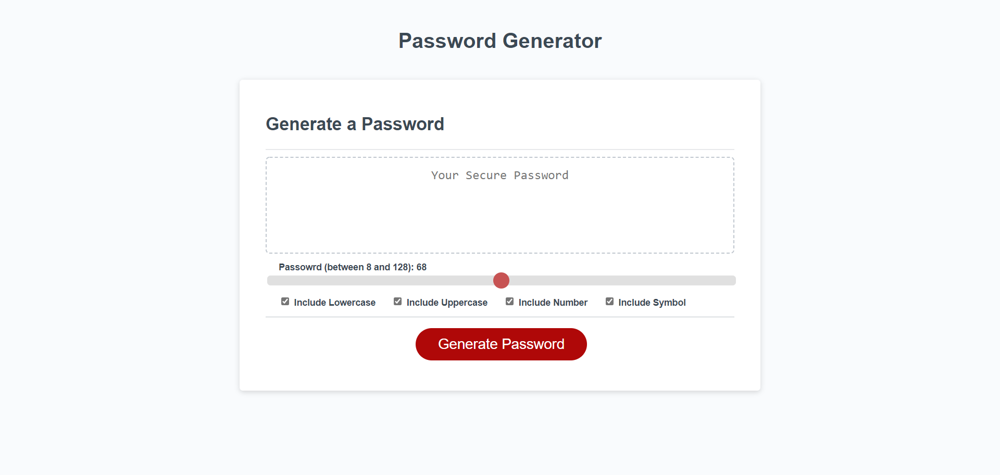

# Password Generator

## Description
This is an application that enables employees to generate random passwords based on criteria that they’ve selected. This app will run in the browser and will feature dynamically updated HTML and CSS powered by JavaScript code that you write. It will have a clean and polished, responsive user interface that adapts to multiple screen sizes.

## Table of content

## Repository

You can get the code in the following link. https://github.com/sreevinithaa/Password_generator_28_02_2022.git

## Production link

You can view my portfolio through this live link https://sreevinithaa.github.io/Password_generator_28_02_2022/index.html